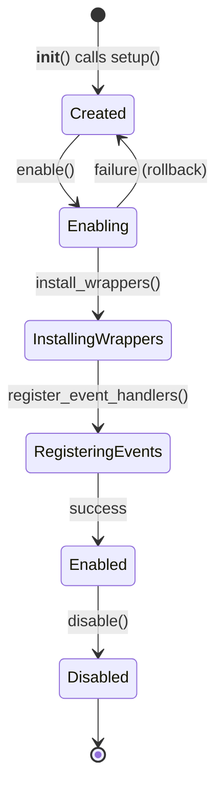
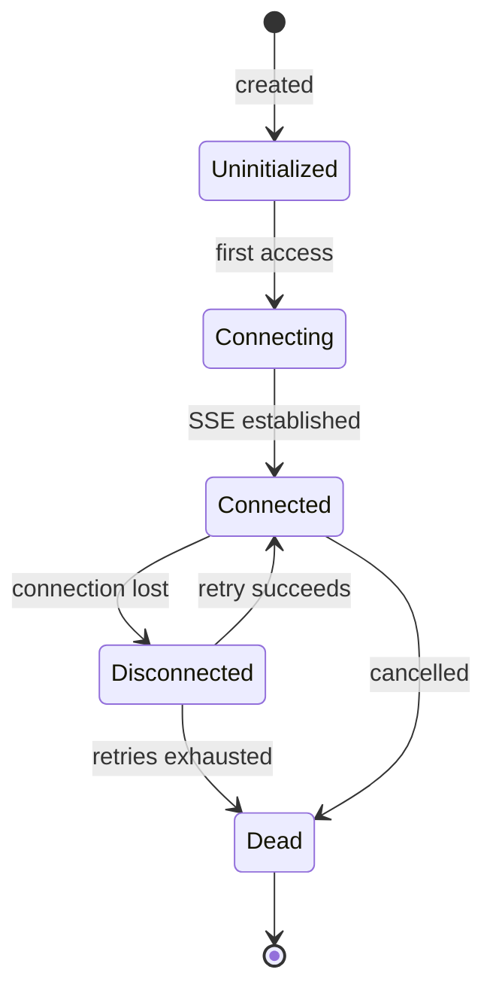

# Core Concepts

This page explains the key abstractions in Qorme. Understanding these will help you configure, debug, and extend the SDK effectively.

## TrackingManager

The `TrackingManager` is a **thread-safe singleton** that orchestrates everything. It:

1. Reads your configuration (the `QORME` dictionary)
2. Creates shared dependencies (`Deps`)
3. Initializes and enables each configured domain
4. Registers an `atexit` handler to clean up on shutdown

In Django, the manager is installed automatically by the `qorme_django` AppConfig:

```python
# This happens inside qorme_django/apps.py — you don't call it directly
TrackingManager.install(settings=settings.QORME, defaults=QORME_DJANGO_SETTINGS)
```

The `install()` method uses double-checked locking to ensure only one instance is ever created, even in multi-threaded environments.

You can access the running instance anywhere:

```python
from qorme.manager import TrackingManager

manager = TrackingManager.instance()
if manager:
    print(manager.domain_handlers)  # dict of active domains
```

## Domains

A **Domain** is a self-contained tracking module. It has a clear lifecycle:



Each domain:

- **Installs wrappers** — patches functions using `wrapt` to intercept ORM calls, driver calls, signals, etc.
- **Registers event handlers** — subscribes to events from other domains (e.g., the `Relations` domain listens to `NEW_INSTANCE` events from the `Queries` domain)
- **Is independently enable/disable-able** — if a domain fails to initialize, it rolls back cleanly and other domains continue working

### Domain types

| Type | Base class | What it does |
|:---|:---|:---|
| **Monitoring** | `Domain` | Observes and reports (queries, requests, columns, relations, templates) |
| **Optimization** | `MLDomain` | Uses ML predictions to modify queries at runtime (defer, prefetch) |
| **Infrastructure** | `Domain` | Handles data movement (ingest, database drivers) |

### Domain naming convention

Domains use a dotted naming scheme that maps to configuration:

```
"django.queries"  →  config.django.queries  →  QueryTracking handler
"db.psycopg"      →  config.db.psycopg      →  PsycopgTracking handler
"celery.tracking"  →  config.celery.tracking  →  CeleryTracking handler
```

The `TrackingManager` uses Python's `operator.attrgetter` to resolve the dotted path to a configuration object, which specifies the handler class to instantiate.

## QueryContext

A `QueryContext` represents a **logical unit of work** — an HTTP request, a Celery task, or a management command — during which database queries are executed.

```python
# Simplified — this is what the django.requests domain does internally
with QueryContext(name="/api/posts/", deps=deps, type=ContextType.HTTP):
    # Everything here is tracked as part of this context
    posts = Post.objects.all()  # Query is linked to this request
```

Contexts are stored in a `ContextVar`, making them:

- **Thread-safe** — each thread sees its own context
- **Async-safe** — each coroutine task chain sees its own context
- **Nestable** — a Celery task triggered from a request gets its own context with a `parent_uid` link back

Every query, every template render, and every relationship traversal is attributed to the active context.

## Events

Domains communicate through a **pub/sub event system**. The `Events` class (part of `Deps`) provides typed registration methods:

```python
# The Relations domain subscribes to new instances from the Queries domain
deps.events.register_new_instance_handler(self.on_new_instance)

# The Queries domain fires this when a model instance is created from a query
deps.events.on_new_instance(instance, path, query_tracker, select_related)
```

| Event | Fired by | Consumed by |
|:---|:---|:---|
| `CONTEXT_CREATED` | Requests, Celery, CLI | Ingest |
| `TRACK_MODEL` | Queries | Columns (to patch field descriptors) |
| `QUERY_STARTED` | Queries | Template (to attach template info) |
| `OPTIMIZATION_REQUEST` | Queries | DeferColumns, PrefetchRelations |
| `QUERY_DONE` | Queries | Ingest |
| `NEW_INSTANCE` | Queries | Columns, Relations |
| `CONNECTION_CREATED` | DB drivers | Ingest |
| `SQL_QUERY_STARTED` | DB drivers | — |
| `SQL_QUERY_DONE` | DB drivers | Ingest |
| `FETCH_STARTED` | DB drivers | — |
| `FETCH_DONE` | DB drivers | — |
| `SQL_RESULT_HASH_COMPUTED` | ResultHash | Ingest |
| `QUEUE_FLUSH` | Queue | Ingest internals |
| `PROCESS_PAYLOAD` | Queue | Columns |

Events are fire-and-forget: if a handler raises an exception, it's logged but other handlers still execute.

## Deps (Dependencies)

`Deps` is a **lazy dependency container** shared by all domains. It provides:

| Property | Type | What it is |
|:---|:---|:---|
| `events` | `Events` | The event bus for domain communication |
| `traceback` | `Traceback` | Optimized stack frame extractor (C extension + LRU cache) |
| `async_worker` | `AsyncWorker` | Background event loop for non-blocking I/O |
| `http_client` | `Client` | HTTP/2 client for telemetry and SSE |
| `ml_store` | `MLStore` | Thread-safe cache of ML predictions |

All properties are lazily initialized on first access. For example, `ml_store` is only created when an optimization domain (like `DeferColumns`) tries to register a category — meaning it's never constructed if you only use monitoring domains.

## MLStore

The `MLStore` is where ML predictions live inside your SDK. It:

1. **Connects** to the Qorme server via SSE
2. **Receives** model updates as `msgpack`-encoded, base64-wrapped messages
3. **Applies** updates using an immutable replacement pattern (atomic swap)
4. **Serves** predictions to optimization domains via constant-time dictionary lookups



The atomic swap pattern ensures that application threads reading predictions never experience locks or see partial updates — they either get the old state or the new state, never something in between.

## ORMQuery

An `ORMQuery` is a tracker attached to a single ORM query execution. It's created by the `Queries` domain when a `QuerySet` is iterated:

```python
# What happens inside QueryTracking._iterate_wrapper
query_tracker = ORMQuery(
    query=queryset,           # Weak reference to the QuerySet
    model="blog.BlogPost",    # Django model label
    row_type=RowType.MODEL,   # MODEL, DICT, SEQUENCE, or SCALAR
    query_type=QueryType.SELECT,
)
with query_tracker:
    # QUERY_STARTED and OPTIMIZATION_REQUEST events fire here
    for obj in wrapped_iterator:
        # NEW_INSTANCE fires for each model instance
        yield obj
    # QUERY_DONE fires here, duration is recorded
```

It acts as a context manager: entering fires `QUERY_STARTED` and `OPTIMIZATION_REQUEST` events, exiting fires `QUERY_DONE` and records the total duration.

## What's next

Now that you understand the architecture, see:

- [Quickstart](quickstart.md) — get it running
- [Django Setup](../guides/django/setup.md) — full configuration guide
- [Domain Registry](../reference/domains.md) — every domain, its purpose, and its overhead
