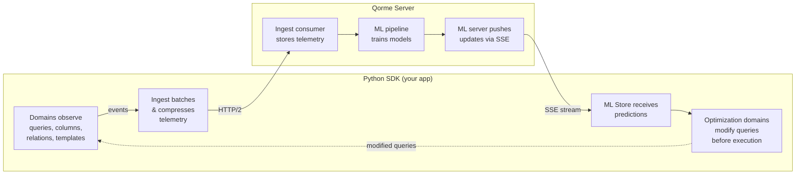

# How It Works

Qorme creates a closed feedback loop between your application's ORM usage and a ML-powered optimization engine. Here's the full picture.

## The Feedback Loop

### Step by step

**1. Observe** — Tracking domains instrument your ORM at the function level. When a Django `QuerySet` is iterated, Qorme's `QueryTracking` domain wraps the iteration to capture the model, SQL, execution time, traceback, and result fingerprint — all without changing your code.

**2. Collect** — Each domain pushes structured events onto a high-capacity queue. The `Ingest` domain runs a background thread that batches events by size or time, serializes them with `msgspec`, compresses with `isal` or `gzip`, and streams them to the server over HTTP/2.

**3. Analyze** — The Qorme server receives telemetry, stores it in TimescaleDB, and feeds it into an ML pipeline. The pipeline learns patterns specific to your project — for example, "in this view, the `body` column on `BlogPost` is never accessed" or "accessing `post.author` always triggers a separate query."

**4. Predict** — The server trains lightweight decision-tree models and pushes them back to your SDK over a long-lived Server-Sent Events (SSE) connection. The SDK's `MLStore` receives these updates and stores them in an in-memory cache using an atomic swap pattern — readers never see partial updates.

**5. Optimize** — When a new query is prepared, optimization domains like `DeferColumns` and `PrefetchRelations` consult the local `MLStore`. If the model predicts that certain columns won't be used, the domain calls `query.add_deferred_loading()` before the SQL is generated. If relationships are predicted to be accessed, it injects `prefetch_related()` lookups. The database sees an optimized query — your code is unchanged.

## What makes this different from APM tools

Traditional application performance monitoring tools (Datadog, New Relic, Sentry Performance) **observe and alert**. You still have to manually fix the issues they surface.

Qorme **observes and acts**. The SDK modifies your ORM queries at runtime based on ML predictions trained on your actual usage data. There's no manual code change required.

| | Traditional APM | Qorme |
|:---|:---|:---|
| Detects N+1 queries | ✅ Some | ✅ Yes |
| Detects unused columns | ❌ No | ✅ Yes |
| Fixes N+1 automatically | ❌ No | ✅ Yes |
| Fixes column waste automatically | ❌ No | ✅ Yes |
| Requires code changes | — | ❌ No |
| Framework-aware | Varies | ✅ Deep ORM integration |

## Data flow in detail

### Telemetry (SDK → Server)

Every tracking context (HTTP request, Celery task, management command) produces a `QueryContext` containing:

- Context metadata (URL, view name, task ID, timestamps)
- ORM queries with SQL, params hash, duration, traceback, result hash
- Column access bitmaps per model per query
- Relationship traversal paths

This is serialized as `msgspec`-encoded `msgpack`, compressed, and sent as batched HTTP/2 POST requests.

### Predictions (Server → SDK)

The server sends `MLModelsUpdate` messages over SSE. Each update contains:

- A **category** (e.g., `defer-columns`, `prefetch-relations`)
- A **model name** (the Django model label, e.g., `blog.BlogPost`)
- **Samples** — individual predictions keyed by a hash of the execution context (view + traceback + model path)

Each sample contains a decision tree and a `stable` flag. Only stable predictions (trained on sufficient data) are applied.

## Next

- [Core Concepts](concepts.md) — understand the abstractions: Domains, Contexts, Events, MLStore
- [Quickstart](quickstart.md) — get it running in your project
