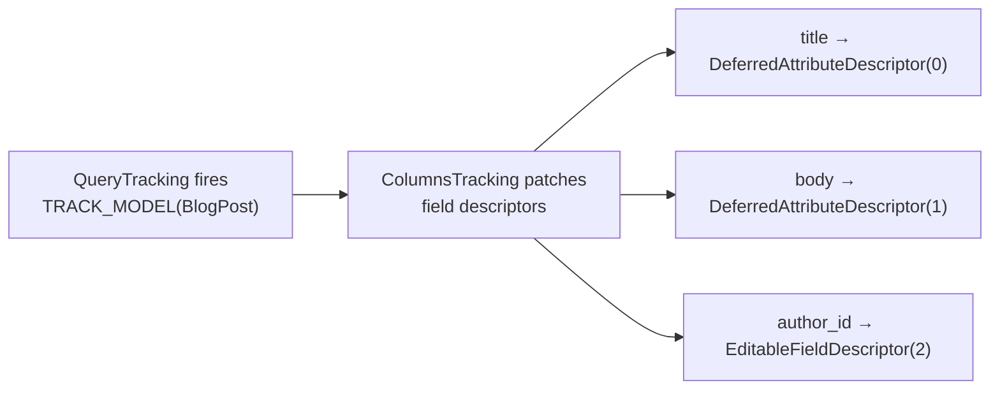

# Columns & Relations Tracking

The `django.columns` and `django.relations` domains provide field-level visibility into how your code uses Django models. This data feeds the ML optimization pipeline.

## Column tracking (`django.columns`)

### How it works

When the `Queries` domain encounters a new model for the first time, it fires a `TRACK_MODEL` event. The `Columns` domain responds by patching every field descriptor on that model class:



Each field gets a descriptor wrapper with a numeric **index**. When your code accesses a field (e.g., `post.title`), the descriptor sets that index in a `BitSet` attached to the model instance:

```python
# Inside FieldDescriptor.__get__
def __get__(self, instance, cls):
    if accessed := self._get_columns_accessed(instance):
        accessed.set(self.index)     # Bit-level tracking — O(1), near-zero overhead
    return self._get(instance, cls)  # Call the original descriptor
```

### What's tracked

For each model path in each query, Qorme records three bitsets:

| Bitset | Meaning |
|:---|:---|
| `columns_loaded` | Which columns were fetched from the database |
| `columns_required` | Which columns are structurally required (PK, join columns) |
| `columns_accessed` | Which columns your code actually read |

The difference between `columns_loaded` and `columns_accessed` reveals wasted data — columns fetched but never used.

### Descriptor types

The `Columns` domain wraps descriptors differently based on their type:

| Django descriptor | Qorme wrapper | Why |
|:---|:---|:---|
| `DeferredAttribute` | `DeferredAttributeDescriptor` | Also implements `__set__` and `__delete__` to maintain data descriptor behavior |
| `ForeignKeyDeferredAttribute` | `EditableFieldDescriptor` | Foreign keys need `__set__` for assignment |
| Custom descriptors | Must be registered in `known_descriptors` config | Qorme raises `UnknownDescriptorError` for safety |

!!! info "Why `UnknownDescriptorError`?"
    If Qorme encounters a field descriptor it doesn't recognize, it raises an error rather than silently ignoring it. This prevents false "unused column" reports that could lead the ML model to incorrectly defer fields that are actually accessed through a custom descriptor.

### Configuration

```python title="settings.py"
QORME = {
    "django": {
        "columns": {
            "known_descriptors": {
                "myapp.fields.EncryptedFieldDescriptor",
            },
        },
    },
}
```

## Relation tracking (`django.relations`)

### How it works

The `Relations` domain tracks how your code traverses model relationships. It patches Django's relationship descriptors to record which field triggered each related query.

**What's patched:**

| Descriptor | Relationship type |
|:---|:---|
| `ForwardManyToOneDescriptor.get_queryset` | `ForeignKey` forward access (`post.author`) |
| `ReverseOneToOneDescriptor.get_queryset` | `OneToOneField` reverse access (`user.profile`) |
| `ReverseManyToOneDescriptor.__get__` | Reverse FK and M2M (`author.posts`, `post.tags`) |

When a related query fires, the domain:

1. Looks up the related instance from `queryset._hints["instance"]`
2. Identifies which field triggered the access from `queryset._hints["_field"]`
3. Records a `Relation` object on the `ORMQuery` with the parent model, field name, depth, and whether it came from a deferred field reload

### Depth tracking

Each model instance carries a hidden `__rel_info__` tuple: `(path, depth, timestamp, uid)`. When accessing `post.author.organization`, the depth increments at each level:

```
post            → depth=0 (root query)
post.author     → depth=1 (first relation)
post.author.org → depth=2 (second relation)
```

The path is built using Django's `__` separator: `blog.BlogPost__author__organization`.

### N+1 detection

Relation data combined with query tracking enables N+1 detection:

1. If multiple queries hit the same model and field, from the same parent query, at depth 1+ → likely N+1
2. The server aggregates these patterns and can train the `prefetch-relations` ML model to auto-fix them

### Deferred field reloads

When Django lazily loads a deferred field (accessing a `.defer()`'d column), it calls `refresh_from_db()`. The `Relations` domain wraps this method to distinguish between genuine relationship traversals and deferred column reloads — which is critical for the ML model to accurately predict prefetch targets.

## Overhead

| Domain | Per-query overhead | Per-instance overhead |
|:---|:---|:---|
| `django.columns` | Descriptor lookup (one-time per model) | `BitSet.set()` per field access — C extension, O(1) |
| `django.relations` | Event handler call | `__rel_info__` tuple assignment |

Both are designed for minimal production impact. The `BitSet` is implemented as a Cython C extension for maximum performance.

## What's next

- [Auto-Optimization](optimization.md) — how this data feeds the ML models
- [Domain Registry](../../reference/domains.md) — all available domains
