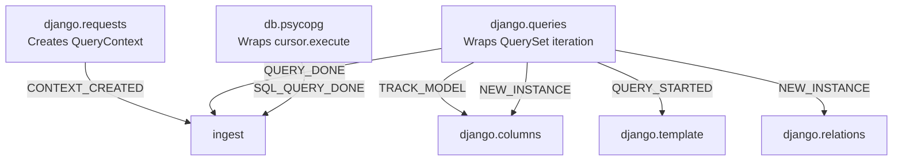

# Django Observability

What Qorme tracks out of the box in a Django project, and how the data flows from your ORM to the dashboard.

## Query tracking (`django.queries`)

The `QueryTracking` domain is the foundation. It wraps Django's internal queryset iterators to capture every ORM query:

**What's captured per query:**

| Field | Description |
|:---|:---|
| Model label | Django model name (e.g., `blog.BlogPost`) |
| Query type | `SELECT`, `EXISTS`, `COUNT` |
| Row type | `MODEL`, `DICT`, `SEQUENCE`, `SCALAR` |
| Duration | Execution time in microseconds |
| Traceback | Call stack frames (up to 10 by default, configurable) |
| Result fingerprint | Hash of the query for deduplication |
| Context UID | Link to the parent `QueryContext` (request/task) |

**What's instrumented:**

- `ModelIterable.__iter__` — standard queryset iteration (`list(qs)`, `for obj in qs`)
- `ValuesIterable.__iter__` — `.values()` queries
- `ValuesListIterable.__iter__` — `.values_list()` queries
- `FlatValuesListIterable.__iter__` — `.values_list(flat=True)` queries
- `NamedValuesListIterable.__iter__` — `.values_list(named=True)` queries
- `QuerySet.exists` — `.exists()` calls
- `QuerySet.count` — `.count()` calls

### Model filtering

By default, all models are tracked. Use `apps_to_include` / `apps_to_exclude` or `models_to_include` / `models_to_exclude` to narrow the scope:

```python title="settings.py"
QORME = {
    "django": {
        "queries": {
            "apps_to_exclude": ["django", "admin"],  # Skip Django's own models
        },
    },
}
```

!!! tip "Skipping queries without a context"
    If a query runs outside a `QueryContext` (e.g., during migrations or in a raw shell), it's silently skipped. No patching overhead is applied.

## Request tracking (`django.requests`)

The `RequestTracking` domain creates a `QueryContext` for each HTTP request, linking all queries to the request that triggered them.

**How it works:**

1. Wraps `BaseHandler.resolve_request` to capture the view name, URL path, HTTP method, and query string
2. Creates a `QueryContext` with `type=ContextType.HTTP`
3. Listens for `request_finished` signal to close the context and record duration

**What's captured per request:**

| Field | Description |
|:---|:---|
| Name | View name from URL resolver (falls back to path) |
| Method | HTTP method (`GET`, `POST`, etc.) |
| Path | URL path |
| Query string | Raw query string |
| URL name | Django URL name from `urlpatterns` |

### Ignoring paths

```python
QORME = {
    "django": {
        "requests": {
            "ignore_paths": ["/health/", "/readiness/", "/__debug__/"],
        },
    },
}
```

Matching paths won't create a context, so their queries won't be tracked at all.

## Template tracking (`django.template`)

The `TemplateTracking` domain adds template attribution to queries — it tells you which template file and line number triggered each database query.

**How it works:**

1. Wraps `django.template.backends.django.Template.render`
2. Sets a context state flag `in_template_render=True` during rendering
3. On `QUERY_STARTED` events, walks the Python stack to find the active `Node`
4. Extracts the template filename and line number from `node.origin`

**What's captured:**

| Field | Description |
|:---|:---|
| Template name | Template file path (e.g., `blog/post_list.html`) |
| Line number | The template line that triggered the query |
| Line content | The actual template tag content |

!!! note "Template tracking overhead"
    The template walker performs a frame-by-frame stack walk during each query inside a template render. This is the most expensive tracking domain. Enable it for deep debugging, disable it for minimal overhead.

## SQL-level tracking (`db.*`)

Separately from ORM tracking, the database driver domains (`db.psycopg`, `db.psycopg2`, `db.sqlite`) track raw SQL execution:

**What's captured per SQL query:**

| Field | Description |
|:---|:---|
| SQL text | The raw SQL statement |
| Execution time | Start and end timestamps |
| Connection UID | Which database connection executed the query |
| ORM Query UID | Link to the parent `ORMQuery` (if applicable) |
| Context UID | Link to the parent `QueryContext` |
| Traceback | Call stack at execution time |

This gives you two layers of visibility:

1. **ORM layer** — what your Python code requested (model, queryset method, traceback)
2. **SQL layer** — what actually hit the database (raw SQL, timing, connection)

## How domains communicate

All tracking data flows through the [Events system](../../reference/events.md):



The `ingest` domain collects all events, batches them, and sends them to the server over HTTP/2.

## What's next

- [Auto-Optimization](optimization.md) — how ML models fix queries at runtime
- [Columns & Relations](columns-and-relations.md) — deeper dive into field-level tracking
