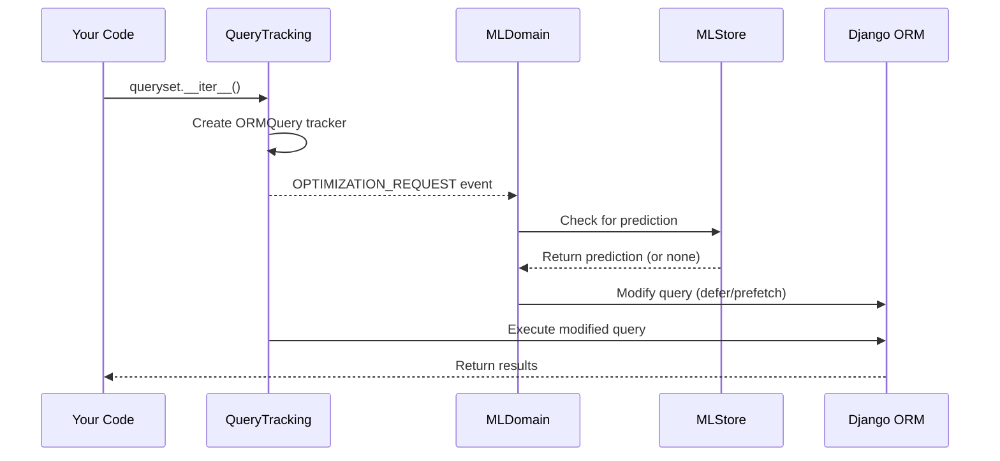

# Automatic Optimization

Qorme's ML-driven optimization engine modifies Django ORM queries at runtime — deferring unused columns and prefetching N+1 relationships — without any code changes.

## How it works



### The optimization window

Optimization happens in a critical window: **after the `ORMQuery` tracker is created, but before the SQL is generated**. The `OPTIMIZATION_REQUEST` event fires during `ORMQuery.__enter__()`, giving optimization domains a chance to modify the underlying Django query object.

This works because Django's `QuerySet` builds SQL lazily — the `query.sql_with_params()` method isn't called until iteration actually begins. Qorme injects changes into the internal `query` object before that happens.

## Column deferring (`django.defer_columns`)

**Domain ID:** `django.defer_columns`  
**ML Category:** `defer-columns`

### What it does

Automatically adds `.defer()` to queries when the ML model predicts that certain columns won't be accessed by your code. This reduces the amount of data transferred from the database.

### How it decides

1. Receives `OPTIMIZATION_REQUEST` with the `ORMQuery` tracker
2. Checks that the query returns model instances (`RowType.MODEL`)
3. Skips if `.defer()` or `.only()` are already applied (respects developer intent)
4. Skips if `select_related()` was called without arguments (all fields needed)
5. Walks the model and all `select_related` joins
6. For each model, looks up an ML prediction keyed by the execution context (view, traceback, model path)
7. If the prediction is stable, collects columns to defer
8. Calls `query.add_deferred_loading(to_defer)` on the internal Django query

### Example

Your view fetches blog posts but only uses `title` and `created_at`:

```python
# Your code — unchanged
posts = BlogPost.objects.all()
for post in posts:
    print(post.title, post.created_at)
```

After the ML model learns this pattern, Qorme automatically transforms the query:

```sql
-- Before (all columns)
SELECT id, title, slug, body, excerpt, created_at, updated_at, author_id
FROM blog_post;

-- After (Qorme defers unused columns)
SELECT id, title, created_at FROM blog_post;
```

### Safety guarantees

- If your code accesses a deferred column, Django transparently fetches it with an additional query. There's no crash or data loss — just a potential extra query that Qorme will learn to avoid in future predictions.
- The primary key and all join columns (for `select_related`) are always marked as "required" and never deferred.
- Predictions include a `stable` flag. Only predictions trained on sufficient data are applied.

## Relationship prefetching (`django.prefetch_relations`)

**Domain ID:** `django.prefetch_relations`  
**ML Category:** `prefetch-relations`

### What it does

Automatically adds `.prefetch_related()` to queries when the ML model predicts that related objects will be accessed, preventing N+1 query patterns.

### How it decides

1. Receives `OPTIMIZATION_REQUEST` with the `ORMQuery` tracker
2. Checks that the query returns model instances (`RowType.MODEL`)
3. Looks up ML predictions for the base model
4. If the prediction indicates relationships will be traversed, adds those as `prefetch_related` lookups
5. Recurses through predicted relationships — if `author` is predicted, it also checks whether `author.organization` will be accessed
6. Merges with any existing `prefetch_related` lookups from your code

### Example

Your template iterates posts and accesses the author:

```html+django

    <p>{{ post.title }} by {{ post.author.name }}</p>

```

Without Qorme, this is an N+1: one query for posts, then one query per `post.author` access. After learning the pattern:

```python
# Qorme internally transforms the queryset to:
BlogPost.objects.prefetch_related("author")
```

### Safety guarantees

- If your code doesn't access a prefetched relation, the extra query is wasted but harmless.
- Existing `prefetch_related` lookups from your code are preserved and merged.
- The prefetch is applied to the queryset's `_prefetch_related_lookups`, not the underlying SQL query.

## Enabling optimization

Add the optimization domains to your config:

```python title="settings.py"
QORME = {
    "domains": [
        # ... observability domains ...
        "django.defer_columns",
        "django.prefetch_relations",
    ],
}
```

!!! warning "Requirements"
    Optimization domains need:

    1. A running Qorme server with ML pipeline enabled
    2. An active SSE connection (`ml_store.connected()` returns `True`)
    3. Sufficient telemetry data for the ML models to reach `stable` status

    Without these, the domains are enabled but silently do nothing.

## Monitoring optimizations

Each applied optimization is recorded in the `ORMQuery` tracker as `ml_predictions`. This data is sent back to the server as part of the telemetry payload, allowing the dashboard to show:

- Which queries were optimized
- What predictions were applied
- Whether the predictions were accurate (did the code actually access the deferred columns?)

This creates a feedback loop: the server can retrain models based on the accuracy of past predictions.

## What's next

- [Columns & Relations](columns-and-relations.md) — how field access and relationship tracking feeds the ML models
- [Configuration reference](../../reference/configuration.md) — all config options for optimization domains
