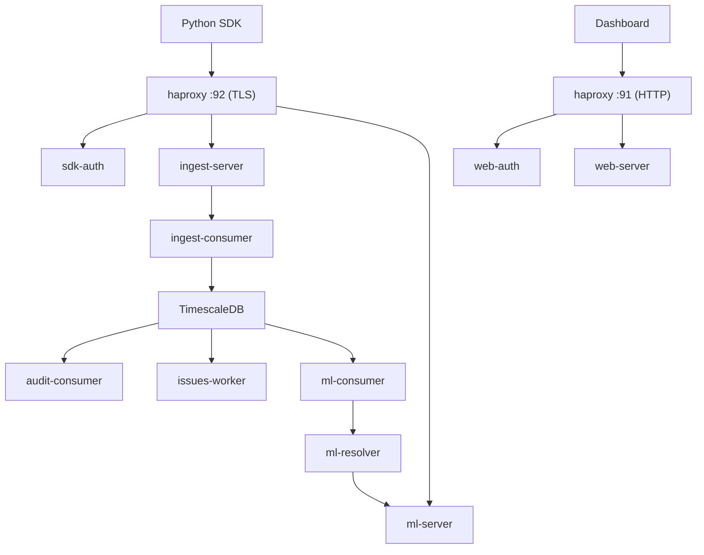

# Server Setup

The Qorme SDK sends telemetry to and receives ML predictions from a Qorme server. You can use the managed **Qorme Cloud** or **self-host** the server.

## Option 1: Qorme Cloud

The easiest way to get started. Qorme Cloud is a managed service that handles telemetry storage, ML training, and model serving.

1. Sign up at [qorme.com](https://qorme.com)
2. Create a project
3. Copy the project DSN
4. Add it to your SDK configuration:

```python title="settings.py"
QORME = {
    "deps": {
        "http_client": {
            "dsn": "https://<API_KEY>@api.qorme.com/sdk",
        },
    },
}
```

## Option 2: Self-hosted

The Qorme server is a Go application distributed as Docker images. It uses TimescaleDB for telemetry storage and includes a full ML pipeline.

### Requirements

- Docker and Docker Compose
- At least 2 GB RAM
- PostgreSQL 18 with TimescaleDB (provided via Docker image)

### Architecture

The self-hosted deployment consists of several services behind a single HAProxy ingress:



| Service | Purpose | Port |
|:---|:---|:---|
| `haproxy` | Unified ingress — TLS termination for SDK, HTTP routing for dashboard | 91 (web), 92 (SDK) |
| `sdk-auth` | API key validation for SDK connections | — |
| `web-auth` | User authentication for the dashboard | — |
| `ingest-server` | Receives telemetry from SDKs | — |
| `ingest-consumer` | Processes and stores telemetry in TimescaleDB | — |
| `web-server` | Serves the dashboard API | — |
| `audit-consumer` | Processes audit log events | — |
| `issues-worker` | Detects and surfaces performance issues | — |
| `ml-consumer` | Trains ML models on collected telemetry | — |
| `ml-resolver` | Resolves and validates trained models | — |
| `ml-server` | Serves ML predictions to SDKs via SSE | — |
| `db` | TimescaleDB 2.26 on PostgreSQL 18 | — |

### Quick start

```bash
git clone https://github.com/qorme/qorme.git
cd qorme

# Copy example env files
for f in docker/env/*.example; do cp "$f" "${f%.example}"; done

# Start all services
docker compose up -d
```

The dashboard will be available at `http://localhost:91`.

### Configuration

Each service reads from environment files in `docker/env/`. The key files:

| File | What to configure |
|:---|:---|
| `docker/env/db` | PostgreSQL credentials |
| `docker/env/common` | Shared settings (database URL, data directory) |
| `docker/env/web.auth` | Authentication provider (SSO) settings |
| `docker/env/sdk.auth` | API key validation settings |

### Getting an API key

After starting the server:

1. Open `http://localhost:91` in your browser
2. Log in or create an account
3. Create a new project
4. The project page shows your DSN — use this in your SDK configuration

### TLS certificates

The HAProxy service expects TLS certificates at `docker/certs/`. For local development, generate self-signed certs:

```bash
mkdir -p docker/certs
openssl req -x509 -newkey rsa:2048 -keyout docker/certs/key.pem \
  -out docker/certs/cert.pem -days 365 -nodes \
  -subj "/CN=localhost"
cat docker/certs/cert.pem docker/certs/key.pem > docker/certs/server.pem
```

For production, use certificates from your preferred CA or a reverse proxy like Caddy/nginx.

!!! warning "SSL verification in development"
    When using self-signed certificates, disable SSL verification in the SDK:

    ```python
    QORME = {
        "deps": {
            "http_client": {
                "dsn": "https://<API_KEY>@localhost:92/sdk",
                "verify_ssl": False,  # Only for development!
            },
        },
    }
    ```

## Licensing

| Component | License |
|:---|:---|
| Python SDK (`qorme`, `qorme-django`) | Apache 2.0 |
| Qorme Server | [FSL-1.1-ALv2](https://fsl.software/) — free for non-competing use, converts to Apache 2.0 after 2 years |

The FSL license allows you to self-host and use the server for your own projects. You cannot offer it as a competing commercial service.

## What's next

- [Quickstart](../getting-started/quickstart.md) — configure the SDK to connect to your server
- [Deployment](deployment.md) — production deployment for the SDK
