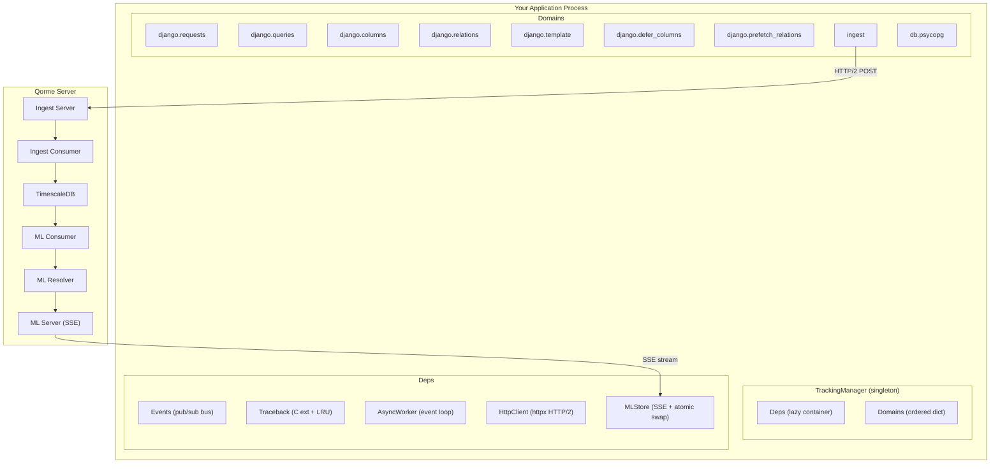
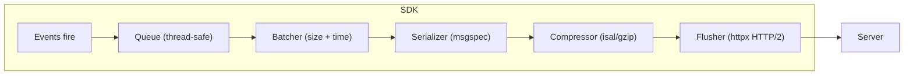

# Architecture Deep Dive

A detailed look at Qorme's internal architecture, data flow, and design decisions.

## System architecture



## Component design

### TrackingManager

The `TrackingManager` is a **thread-safe singleton** using double-checked locking:

```python
@classmethod
def install(cls, settings, defaults):
    if cls._instance is not None:
        return cls._instance
    with cls._lock:
        if cls._instance is not None:
            return cls._instance
        instance = cls(settings, defaults)
        cls._instance = instance
    return instance
```

It:
1. Merges user settings over defaults using recursive dictionary merge
2. Creates the `Deps` container (but doesn't initialize any dependencies yet — they're all lazy)
3. Iterates the `domains` list and instantiates each handler class (which calls `setup()` during `__init__`)
4. Calls `domain.enable()` on each domain, which triggers `install_wrappers()` → `register_event_handlers()`
5. Registers an `atexit` handler that calls `stop()` which disables all domains and closes dependencies

### Deps (Lazy dependency container)

All shared services are lazily initialized on first access. For example:

- `deps.events` is created on first access (typically the first domain to register a handler) — it's a cheap `defaultdict(set)`
- `deps.traceback` is created on first query (initializes C extension LRU caches)
- `deps.ml_store` is created only when an `MLDomain` registers a category
- `deps.async_worker` is created when ingest needs a background event loop

This means if you only enable monitoring domains (no optimization), the `MLStore` and its SSE connection are never created.

### Domain lifecycle

Each domain follows a strict lifecycle. `setup()` runs during `__init__()` (construction), then `enable()` handles wrapping and event registration with rollback on failure:

```python
def __init__(self, deps, config):
    # ...
    self.setup()              # Domain-specific initialization

def enable(self):
    try:
        self.install_wrappers()       # Patch functions via wrapt
        self.register_event_handlers() # Subscribe to events
    except Exception:
        self.uninstall_wrappers()  # Clean rollback
        self.unregister_event_handlers()
        return False
```

`disable()` reverses everything: unregisters event handlers, removes all wrappers via `wrapper.clear()`.

### Wrapping via `wrapt`

All function patching uses the `wrapt` library through Qorme's `Wrapper` helper. Key properties:

- **Weak references** — The `Wrapper` class stores weak references to wrapper functions, preventing memory leaks
- **Duplicate detection** — Wrapping the same member twice raises `AlreadyWrappedError` or `DuplicateWrapperError`
- **Clean unwrap** — `unwrap()` restores the original function, checking that the current wrapper is still the one we installed
- **Thread safety** — `wrapt.ObjectProxy` is thread-safe for attribute access

### Events (typed pub/sub)

The event system uses a `dict[EventType, set[EventHandler]]`:

- **Set-based** — No guaranteed ordering; handlers can fire in any order
- **Exception isolation** — If a handler raises, it's logged but other handlers continue
- **Typed API** — Each event has dedicated `register_*`, `unregister_*`, and `on_*` methods (no string-based dispatch)
- **No async** — All handlers are synchronous, running on the calling thread

### Ingest pipeline



The ingest pipeline runs on a background thread:

1. **Queue** — Thread-safe queue with configurable max size. Events beyond the limit are dropped with a warning.
2. **Batcher** — Accumulates events until `batch_min_size` or `flush_max_interval` is reached, caps at `batch_max_size`
3. **Serializer** — `msgspec.msgpack` for zero-copy serialization
4. **Compressor** — `isal` (hardware-accelerated on x86/aarch64) with fallback to `gzip`
5. **Flusher** — HTTP/2 POST with retry logic (exponential backoff + jitter)

### MLStore (atomic model updates)

The `MLStore` receives ML model updates over SSE and serves them to optimization domains:

- **Immutable replacement** — When an update arrives, a new dictionary is built and atomically swapped in. Readers always see a consistent snapshot.
- **Thread-safe reads** — No locks needed because Python dict reads are atomic for reference replacement
- **Category-based** — Each optimization domain registers a category (e.g., `defer-columns`). Models are organized by category → model label → samples.
- **Connection lifecycle** — Runs on the `AsyncWorker` event loop. Retries with configurable backoff on connection loss.

## Design decisions

### Why `wrapt` instead of monkey-patching?

`wrapt` handles edge cases that naive `setattr` patching misses:

- Classmethods and staticmethods
- Descriptors and properties
- Bound vs unbound methods
- Nested wrapping (e.g., another library also patching `QuerySet`)

### Why `msgspec` instead of `json`?

- 10-50x faster serialization than `json.dumps`
- Type-safe struct definitions (not arbitrary dicts)
- Zero-copy `msgpack` encoding (binary, smaller payloads)
- Native support for `datetime`, `UUID`, `bytes`

### Why `ContextVar` instead of thread-local?

- Works correctly with `asyncio` (each coroutine gets its own copy)
- Works with Python 3.12+ free-threaded mode
- Supports nesting (Celery task from HTTP request gets a new context)

### Why C extensions for hot paths?

Three modules are compiled from Cython:

| Module | Why |
|:---|:---|
| `bitset` | Column tracking needs per-field-access bit setting — C is 100x faster than Python `set()` for this |
| `traceback` | Stack frame extraction runs on every query — C avoids Python frame object overhead |
| `lru_cache` | Frame/file lookups are highly repetitive — C LRU avoids `dict` overhead |
